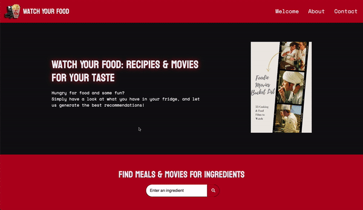

# Watch Your Food - Foodie Movies Bucket List
A website for generating ideas for movies and food based off of an ingredient.

## Project Description

For Module 9's Challenge, we were challenged to make a website from scratch utilising JavaScript, two server-side APIs, Bootstrap and client-side storage whilst together working in a group.

Our idea was to create a website for a date or movie night that would provide inspiration on what the user could watch and cook for the evening.

The website we made will create a list of films and recipes based off on an ingredient that the user inputs using the search feature. A grid of movies will then generate upon hitting search, along with a list of recipes underneath.

## Usage
Simply search an ingredient through the search box & movie and recipies will get generated for you. To get more infor about the recipies click the Get Recipe button. Additionally, you can view your search history in the Preious Searches section.

Please visit the deployed website here: https://khnfarha1987.github.io/receipe-movies-project/

Repository link: https://github.com/khnfarha1987/receipe-movies-project

## Our Approach
On the first day of the challenge, we started off by creating a Google Doc stating all of the requirements for the project, along with our general ideas. Once we had decided what we wanted to make, we then created a mock-up of how we'd like the website to look using Penpot. We split the work amongst the 3 of us with Ewa on the Movies API, Farha on the Recipes API and building the website's skeleton and Max on the front-end visuals of the site.

The next day, once we figured out how to collaborate on a shared GitHub repo, we got to work on our allocated tasks. Farha finished the HTML skeleton for Max to work on, whilst Ewa and Farha began to implement their respective APIs.

Once the APIs were functioning correctly, we took a look at the work done on the visual parts of the site. It was a group effort of us all to get the website looking sleek and easy to follow, as we went through many design concepts.

Once these tasks had been completed, the site had some minor touch-ups like changing fonts, colours, and adding hover effects to buttons.

## Technologies
This website was created using HTML, CSS, JavaScript, Bootstrap 4, the Spoonacular API and the OMDb API. 

OMDb: http://www.omdbapi.com/
Spoonacular: https://spoonacular.com/food-api

## License
Please refer to the LICENSE in the repo.